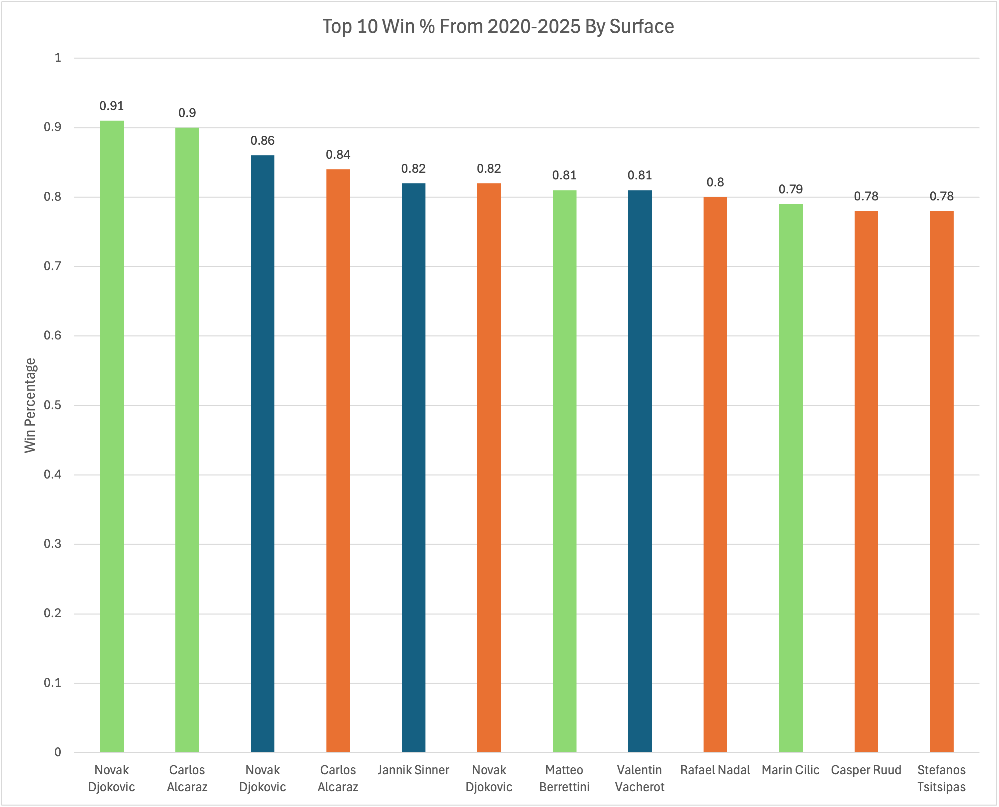
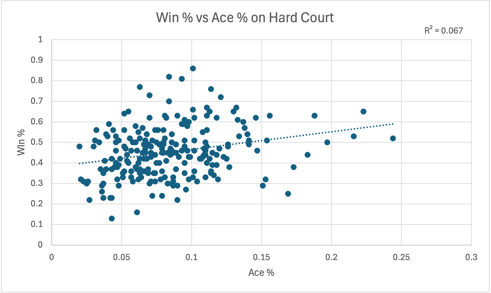
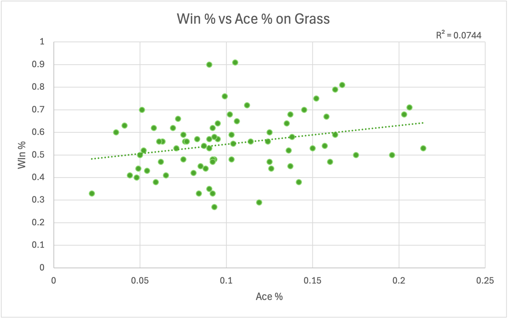
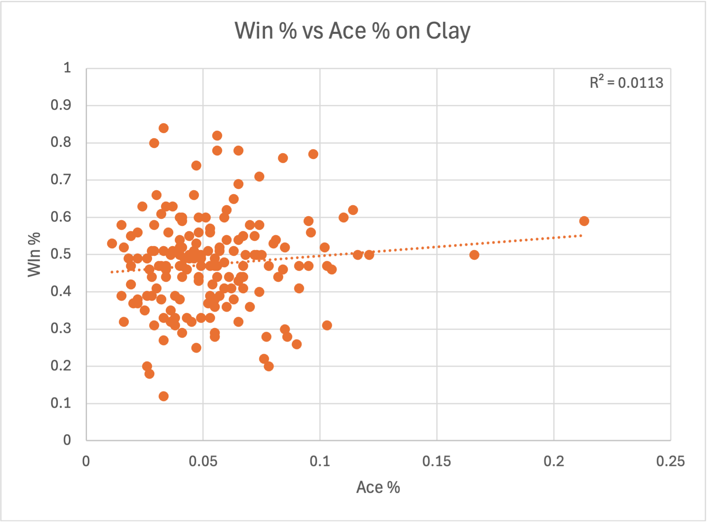
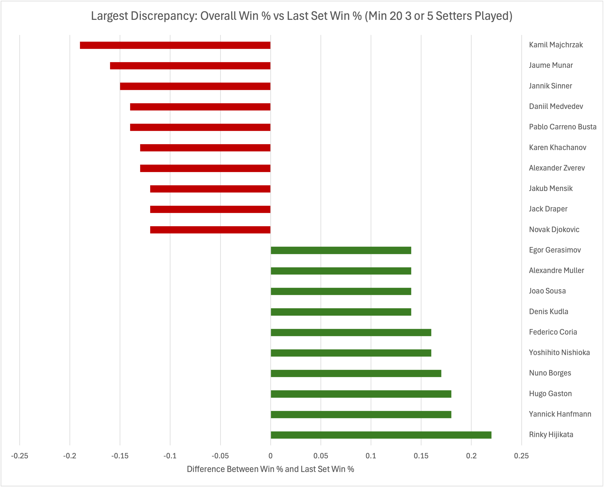

# ATP Tour Performance Analysis (2020–25)

Overview

This project looks at performance on the ATP tour between the 2020 and 2025 seasons. It looks at three angles, overall win rate by surface, the correlation between ace% and win%, and clutch performance in the deciding sets of matches. 

Business Question

Which players win at the highest rate by surface?
Does ace percentage have a correlation to win percentage on each surface?
Which players over and under perform in deciding sets of matches

Data Source

Data was taken from the Tennis Match Database, covering ATP tour-level matches from 2020-2025.
https://stats.tennismylife.org/tennis-match-database

Methodology

Win % by surface (normal_win_pct.sql / win_pct.sql): 
Combined match data across 2020-2025 into a single table
Counted each player's wins and losses grouped by surface (hard, clay, grass)
Joined wins and losses with a full outer join so players who never lost (or never won) on a surface still appear, using coalesce to fill in the name and zero out missing win/loss counts
Calculated win % as wins / total matches played, filtering to players with 15+ matches on that surface to avoid small-sample noise

Overall Win % (normal_win_pct.sql)
Same approach as above, but aggregated across all surfaces combined rather than splitting by surface
Filtered to players with 15+ total matches played

Aces (aces.sql)
For each player, summed aces and serve points across matches won and lost, grouped by surface
Joined the win-side and loss-side aggregates with a full outer join, coalescing names and totals the same way as the win % query
Calculated aces per match and ace % (aces / total serve points)
Filtered to players with 5+ matches on that surface

Last-Set Win % (last_set_win_pct.sql)
Identified 5-set matches at Grand Slams and 3-set matches at all other tour levels (250/500/Masters/Finals/Davis Cup), using the match score field to detect how many sets were played
Counted how often each player won vs. lost when a match reached its final set
Combined these counts across all players who appeared as either a winner or loser in a final set
Calculated last-set win % as final-set wins / total final sets played, filtering to players with 10+ final sets played

Key Findings

The “Top 10 Win % From 2020-2025 By Surface” graph highlights the overarching dominance Djokovic has had, as he claims 3 of the top 6 win percentages on tour. As well, it emphasizes the dominance that certain surface specialists have on their respective surfaces. Ruud on clay, Cilic on grass, Berrettini on grass, all rival Alcaraz and Djokovic's win %.

R² = 0.067. Ace percentage is a weak predictor of win rate, though slightly stronger here than on clay.

R² = 0.0744. The strongest of the three relationships, but still weak overall.

R² = 0.0113. It is the weakest relationship of the three surfaces, reinforcing that rally consistency and return game matter more than raw serve power on slower courts.

In terms of the final sets of matches, it is not surprising to see some of the top players in the world in the red group. They play some grueling 3 and 5 setters against each other, which tend to go either way. But, for Jaume Munar, and Pablo Carreno Busta, 2 top 70 players, it shows a clear growth area as they struggle to pull out wins in the decisive sets. Flipping even a small percentage of those decisive-sets can cause a jump for them in the rankings. 

Tools Used

SQL 
- CTEs
- Filtered Aggregation
- Full outer join
Excel
- Pivot Table 
- Charts

